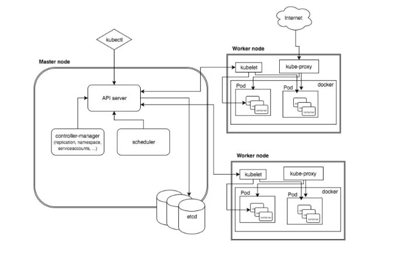

## kubernetes
kubernetes on blockchain

# kubernetes Architecture

# Basics cloud compute

Flexibility: The platform should be designed to offer a high degree of flexibility to its users. It should provide the ability to scale up or down, depending on the user's needs, and allow them to select the computing resources they require.

Security: Security should be a top priority when designing an open cloud platform. The platform should offer robust security features to protect the user's data and computing resources from any unauthorized access or cyber attacks.

Interoperability: The platform should be designed to work seamlessly with other systems and applications. This will enable users to easily integrate the platform into their existing workflows and processes.

Cost-effectiveness: The platform should be designed to offer cost-effective solutions to its users. It should provide a pay-per-use model or other cost-efficient pricing models that help reduce the overall cost of using the platform.

User-friendly: The platform should be easy to use and navigate. The interface should be intuitive, and the user should be able to access the necessary features with ease.

Community-driven: An unseasoned open cloud platform should be designed to foster a strong community around it. It should encourage collaboration and communication among its users, and provide the necessary resources for users to learn, share and build on each other's ideas.

Innovation: The platform should be designed to foster innovation. It should allow users to experiment with new ideas and technologies, and provide the necessary tools and resources for users to innovate and build new applications and services.

# Basics blockchain decentralization

Distributed Control: Blockchain technology allows for decentralized control, which could be leveraged to distribute the control plane in Kubernetes across multiple nodes. This could enhance the fault tolerance of the system and make it more resilient to failures.

Immutable Records: Blockchain is known for its ability to maintain an immutable record of transactions. This feature could be used to maintain an immutable record of changes made to the Kubernetes cluster. This could make it easier to trace and audit changes, which could enhance the security and accountability of the system.

Smart Contracts: Smart contracts in blockchain can be used to define rules and enforce policies. In Kubernetes, this could be used to define policies for resource allocation, access control, and other governance-related tasks.

Consensus Mechanisms: Blockchain uses consensus mechanisms to ensure that all nodes in the network agree on the current state of the system. In Kubernetes, this could be used to ensure that all nodes in the cluster agree on the current state of the resources being managed.

Tokenization: Blockchain uses tokens to represent value within the system. In Kubernetes, this could be used to represent resources such as CPU, memory, and storage. Tokenization could enable more granular and flexible resource management in Kubernetes.

Identity Management: Blockchain has a strong focus on identity management, which could be used in Kubernetes to enhance authentication and authorization processes. Blockchain-based identity management could enable more secure and decentralized access control in Kubernetes.

Interoperability: Blockchain-based Kubernetes could be designed to be more interoperable with other blockchain-based systems, enabling Kubernetes to be integrated with other decentralized systems more easily.

# Redesing Proposal 
Redesigning Kubernetes clusters to use blockchain consensus for joining clusters involves several key changes to the control plane and worker clusters.

First, the etcd cluster, which serves as the backing store for Kubernetes, needs to be modified to use a blockchain consensus algorithm for joining the cluster. This ensures that only valid nodes are allowed to participate in the network, and that all nodes agree on the current state of the etcd cluster.

Second, the API server, which serves as the primary management interface for Kubernetes, needs to be updated to interact with the blockchain network for authentication and authorization. This ensures that only authenticated users and nodes are allowed to access and manage the Kubernetes cluster.

Third, the scheduler and other Kubernetes components need to be modified to interact with the blockchain network for coordinating and managing the deployment and scaling of applications and services.

Finally, the worker nodes need to participate in the blockchain consensus algorithm to prove their authenticity and ensure the integrity of the network. This includes using a proof of stake or proof of work consensus algorithm, depending on the specific requirements and constraints of the deployment.

Overall, the use of blockchain consensus for standing up Kubernetes clusters provides increased security, fault tolerance, and scalability. By leveraging the immutability and decentralized nature of blockchain, the Kubernetes clusters become more resistant to attacks and tampering, and can be more easily distributed across multiple nodes, allowing for increased availability and fault tolerance.

